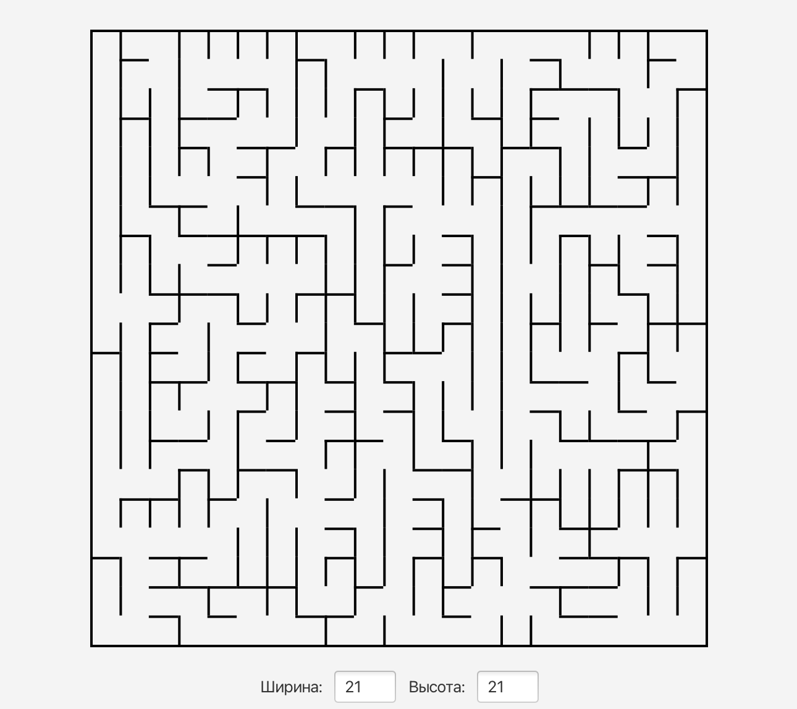
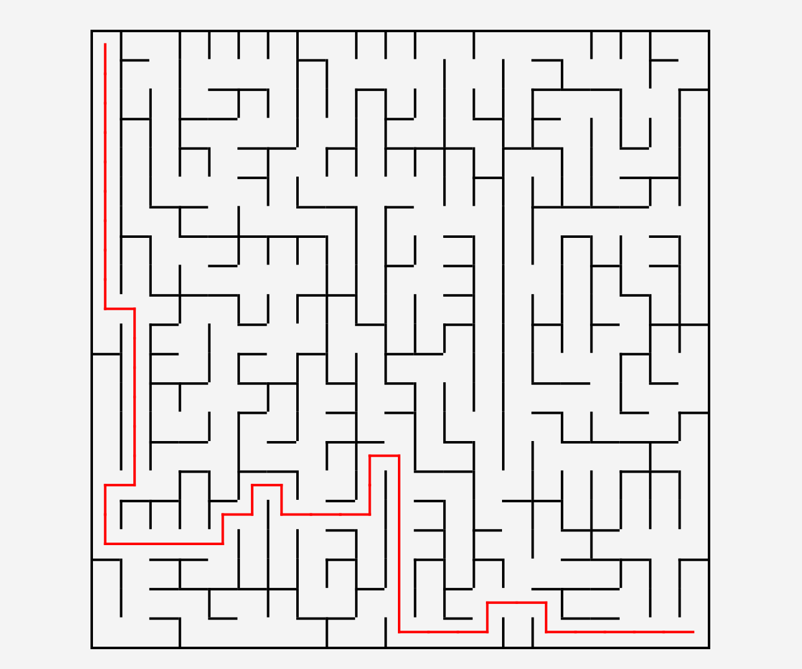

Maze Project
============

Introduction
------------

This project focuses on mazes, covering basic algorithms such as generation, rendering, and solving.

Maze Description
----------------

A maze consists of _n_ rows by _m_ columns with possible walls between cells. The maze is surrounded by walls.

Maze Structure
--------------

The maze is stored as rows, columns, and two matrices indicating the positions of vertical and horizontal walls:

    4 4
    0 0 0 1
    1 0 1 1
    0 1 0 1
    0 0 0 1
    
    1 0 1 0
    0 0 1 0
    1 1 0 1
    1 1 1 1

Maze Generation
---------------

The project includes a feature for generating perfect mazes without isolated areas or loops, using Eller’s algorithm.

Maze Solving
------------

The solution to the maze is the shortest path from a starting point to an endpoint, avoiding walls.

